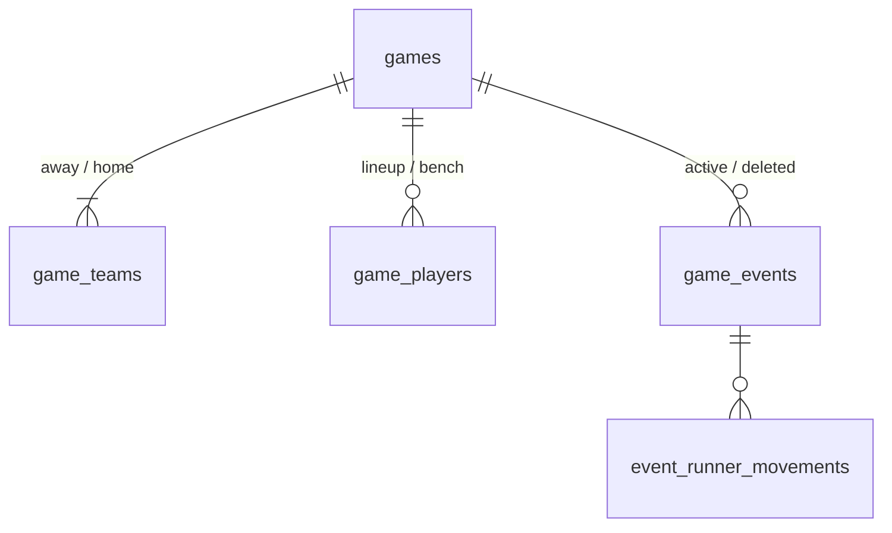

# スコアブッくん

草野球の試合を、ベンチからスマートフォンで記録するためのスコアリングアプリです。打席、走塁、選手交代、得点、打撃・投手成績を一つの画面で管理できます。

試合を作成すると共有用のURLが発行され、URLを知っている人どうしで同じ試合を同時に記録できます。アカウント登録は不要です。試合データはサーバーのデータベースに保存し、各端末にはオフライン用の控えを持ちます。

## 目次

- [主な機能](#主な機能)
- [使い方](#使い方)
- [試合の作成と共有URL](#試合の作成と共有url)
- [記録と判定のしくみ](#記録と判定のしくみ)
- [データ保存とオフライン](#データ保存とオフライン)
- [不具合・改善要望](#不具合改善要望)
- [開発](#開発)

## 主な機能

### 試合設定

- 5回・7回・9回・任意イニングの試合設定
- 両チームの打順、守備位置、控え選手、先発投手の登録
- DH使用時の打順外投手と投手交代

### プレーの記録

- 打席結果の入力（安打、アウト、三振、併殺、四死球、失策、犠打・犠飛、野選、打撃妨害、振り逃げ）
- 打者と各走者の進塁、フォース／タッチアウト、打点の確認・調整
- 走塁イベントの記録（盗塁、盗塁死、牽制死、暴投、捕逸、ボーク）
- 選手交代（代打、代走、守備交代、投手交代）
- 直前プレーの取り消し・やり直しと、過去の打席・走塁イベントの修正
- 雨天中断や確認事項を、その時点の試合状況と一緒に残す試合メモ

### 集計・共有

- イニングスコア、打順表、打撃成績、継承走者を考慮した投手別成績の自動集計
- この端末で開いた試合の履歴表示、再開、履歴からの除外
- Web Share APIによる結果共有
- 試合・試合履歴のエクスポートとインポート（ファイルはJSON形式）

### PWA対応

- ホーム画面への追加と、初回読込後のオフライン利用
- ヘッダーの要望アイコンから、不具合・改善要望の連絡先を表示

## 使い方

1. チーム名、イニング数、選手、守備位置、先発投手を登録する
2. 「試合を作成して開始」を押し、必要なら共有ボタンからURL・QRコードを他の記録者へ渡す
3. 打席終了ごとに「結果入力」から結果を選び、必要に応じて走者の進塁を確認する
4. 走塁だけのプレーや選手交代は、試合画面の専用ボタンから記録する
5. 誤入力は直前プレーの取り消し、または打順表の記録セルから修正する
6. 試合終了後に成績を確認し、共有またはエクスポートする

試合の途中でも、ヘッダー左端のホームアイコンからトップページへ戻れます。試合はサーバーに保存されており、「試合履歴」または共有URLから再開できます。

画面はスマートフォンでの片手操作を優先しています。入力ダイアログは下部から開き、主要な操作領域は44px以上を確保しています。ライブ画面のスコアボードはコンパクト表示から展開でき、打順表は現在イニングへ自動追従します。

## 試合の作成と共有URL

| URL               | 画面                              |
| ----------------- | --------------------------------- |
| `/`               | 試合の作成（チーム・打順の入力）  |
| `/games/{試合ID}` | 試合中・試合結果（同じURLで表示） |

- 「試合を作成して開始」を押すと、サーバーが推測できない試合IDを発行してデータベースに登録し、その試合のURLへ移動します。
- **URLを知っている人は誰でも、同じ試合を閲覧・記録できます**（ログイン不要）。試合画面右上の共有ボタンから、QRコードの表示・URLのコピー・端末の共有機能を使えます。QRコードは端末内で生成し、URLを外部サービスへ送りません。
- 「試合履歴」には、この端末で開いた試合が並びます。履歴から削除しても端末の一覧から外れるだけで、試合自体は共有URLから引き続き開けます。

> [!WARNING]
> URLが編集権限そのものです。公開の場に貼らないでください。試合ページは検索エンジンへの登録とリファラ送信を無効にし、アクセス解析へ送るURLからも試合IDを除去しています。

### 複数人での同時記録

- 試合データはバージョン番号付きで保存されます。保存時に「自分が読み込んだバージョン」を送り、サーバー側がすでに新しくなっていれば保存を拒否します（楽観ロック）。
- 他の人の更新は数秒ごとに自動で画面へ反映されます。
- 自分の未送信の変更と他の人の更新がぶつかった場合は「他の人がこの試合を更新しました」と警告して編集を止め、**上書きはしません**。「最新の内容を読み込む」で最新状態から続けられます（未送信だった自分の変更は破棄されます）。
- 「戻す／やり直す」の履歴は端末ごとに持ち、共有しません。

## データ保存とオフライン

- 正本はデータベース（PostgreSQL）です。各端末の `localStorage` には控えを保存します。
- 通信できない間も記録を続けられます。画面上部に「未送信の変更があります」と表示し、復帰時に自動で再送します。その間に他の人が更新していた場合は上の警告が出ます。
- 試合の新規作成と、初めて開くURLの読み込みにはオンライン接続が必要です。
- 保存形式はschema v2です。読み込んだデータはサーバー・端末の両方で構造と値を検証し、破損データは使用しません。
- Service Workerは本番環境で登録されます。アプリ本体はキャッシュしますが、`/api/` の試合データはキャッシュしません。
- 「試合履歴」は、この端末で開いた試合の控え（`localStorage`）の一覧です。アカウントがないため、サーバー側に「自分の試合一覧」はありません。別の端末では、共有URLを開くかインポートすると履歴に加わります。
- 「試合履歴」のエクスポートで履歴全体を、試合終了画面のエクスポートで1試合をファイルに保存できます。どちらのファイルも「試合履歴」のインポートで読み込め、新しい試合IDでサーバーへ登録されます（元の試合とは別の試合になります）。
- 端末の保存容量が残りわずかになると、古い終了済みの試合のエクスポートを促します。エクスポートするまで削除はしません。
- 共有URL方式へ移行する前に端末内だけへ保存された試合は、履歴に表示されません。

## 不具合・改善要望

各画面のヘッダーにある要望アイコンから連絡先を確認できます。不具合の報告や改善要望は、Xの [@dhythm_dev](https://x.com/dhythm_dev) までお寄せください。公開投稿には個人情報や共有したくない試合データを含めないようご注意ください。

## 開発

### 必要環境

- Node.js 20.12以降
- pnpm
- Docker（ローカルのPostgreSQL用。PGliteを使う場合は不要）

### セットアップ

試合の作成・保存にはデータベースが必要です。次のどちらかで起動します。

#### Docker（PostgreSQL）で起動する — 通常のローカル開発

```bash
pnpm install
cp .env.example .env.local   # 初回のみ
pnpm db:reset          # ボリューム破棄 → 起動 → マイグレーション → シード
pnpm dev
```

`http://localhost:3000` を開きます。2回目以降は `pnpm db:up && pnpm dev` だけで構いません。

- 環境変数は Next.js と同じく `.env.local` → `.env` の優先順で読みます（シェルで指定した値が最優先）。`pnpm dev` だけでなく `pnpm db:*` も同じファイルを読むので、どちらか一方だけで動きます。
- 5432番ポートが使用中の場合は、`.env.local` の `POSTGRES_PORT` と `DATABASE_URL` 内のポート番号を同じ空き番号へ変更してください。
- `drizzle/` のマイグレーションが作り直された・追加されたブランチへ切り替えた後は、`pnpm db:reset`（データを捨ててよい場合）または `pnpm db:migrate` を実行してください。

| コマンド           | 内容                                                              |
| ------------------ | ----------------------------------------------------------------- |
| `pnpm db:up`       | PostgreSQLを起動し、接続可能になるまで待つ                        |
| `pnpm db:migrate`  | `drizzle/` のマイグレーションを適用                               |
| `pnpm db:seed`     | シード試合を初期状態へ戻す（自分で作った試合はそのまま）          |
| `pnpm db:down`     | 停止（データは残る）                                              |
| `pnpm db:reset`    | データごと作り直す（ボリューム破棄→起動→マイグレーション→シード） |
| `pnpm db:generate` | `lib/db/schema.ts` の変更からマイグレーションを生成               |

#### PGlite で起動する — Dockerがない環境（エージェントのサンドボックスなど）

```bash
pnpm install
DATABASE_DRIVER=pglite PGLITE_DATA_DIR= pnpm dev
```

- 環境変数ファイルは不要です（コマンドで渡した環境変数がファイルより優先されます）。
- データベースはNext.jsのプロセス内のメモリ上に作られ、最初のAPIアクセス時にマイグレーションとシード試合の投入が自動で行われます。サーバーを止めるとデータは消えます。
- データを残したい場合は `PGLITE_DATA_DIR=.pglite` を指定します。この場合シードは自動投入されないため、**devサーバーを止めた状態で** `pnpm db:migrate && pnpm db:seed` を実行してください（PGliteのデータディレクトリは同時に1プロセスしか開けません）。

起動後は `/` で試合を作成するか、`/games/seed-live-slugfest` などの[シード試合](#シード試合)を直接開いて確認できます。

### 入力プリセット

セットアップ画面の入力プリセットは、`チーム1`・`チーム2`と、それぞれの`選手1`〜`選手9`、標準の守備位置をまとめて入力します。このプリセットは本番環境でも利用できます。

### 品質確認

| コマンド            | 内容                       |
| ------------------- | -------------------------- |
| `pnpm format:check` | Prettierによる整形チェック |
| `pnpm lint`         | ESLint                     |
| `pnpm typecheck`    | TypeScriptの型チェック     |
| `pnpm knip`         | 未使用コードの検出         |
| `pnpm test`         | Vitestによるテスト         |
| `pnpm build`        | 本番ビルド                 |
| `pnpm test:e2e`     | PlaywrightによるE2Eテスト  |

すべてをまとめて確認する場合は `pnpm check` を実行します。コードをPrettierで整形する場合は `pnpm format` を使用してください。

GitHub Actionsでは、Pull Requestと`main`へのpush時に、format、lint、TypeScript、Knip、test、E2E、PostgreSQLへのマイグレーションとシード投入を独立したジョブとして並列実行します。

E2Eを初めて実行する前に `pnpm exec playwright install chromium` でブラウザを取得してください。E2EはインメモリのPGliteで動くため、DockerもDBの準備も不要です。Next.js 16は同じディレクトリで `next dev` を同時に1つしか起動できないので、`pnpm dev` を起動したままE2Eを実行する場合は `CI=1 pnpm test:e2e`（本番ビルドで実行）を使ってください。

Knipでは、ブラウザから直接読み込まれる `public/sw.js` のみを実行時ファイルとして検査対象外にしています。

### データベース

Drizzle ORMでPostgreSQLに接続します。接続先は環境変数 `DATABASE_DRIVER` で切り替えます。

| `DATABASE_DRIVER`    | 用途                             | 必要な環境変数                    |
| -------------------- | -------------------------------- | --------------------------------- |
| `postgres`（既定値） | ローカル開発（Docker）           | `DATABASE_URL`                    |
| `pglite`             | Dockerを使えないエージェント環境 | `PGLITE_DATA_DIR`（空ならメモリ） |
| `neon`               | デプロイ環境（Neon）             | `DATABASE_URL`                    |

起動手順は[セットアップ](#セットアップ)を参照してください。`neon` への `pnpm db:migrate` は本番データベースを変更するため、実行前に必ず接続先を確認してください。

#### スキーマ



| テーブル                 | 内容                                                                                                                |
| ------------------------ | ------------------------------------------------------------------------------------------------------------------- |
| `games`                  | 試合ID、楽観ロック用の `version` と `last_mutation_id`、状態、開始日時、規定イニング                                |
| `game_teams`             | 先攻・後攻のチーム名、先発投手                                                                                      |
| `game_players`           | スタメンと控え（`roster_role`）、打順、守備位置、リスト内の並び（`sequence`）                                       |
| `game_events`            | 打席・走塁・交代・試合終了・メモ。`kind` ごとの必須列を CHECK 制約で保証。削除済みの記録は `state = 'deleted'` の行 |
| `event_runner_movements` | 各プレーでの走者の動き（どこから・どこへ・打点・アウトの種類）                                                      |

- 保存するのは「記録されたこと」だけです。得点・イニング・個人成績は従来どおり `lib/domain/replay.ts` がイベントから算出し、DBには持ちません。
- イベント内の選手IDには外部キーを張っていません。未知の選手IDは保存を拒否せず、アプリが警告として扱う仕様のためです。
- APIの入出力（JSON）はテーブル構成に依存しません。変換は `lib/server/game-rows.ts` に閉じています。
- 保存時は楽観ロックの `UPDATE` と同じトランザクションで、その試合の子テーブルの行を置き換えます。

#### シード試合

「すでに誰かが作成して記録している試合」を、開始前・試合中・終了後にまたがって用意しています。

| URL                                | 内容                                                                                 |
| ---------------------------------- | ------------------------------------------------------------------------------------ |
| `/games/seed-before-first-pitch`   | 試合開始前。オーダー登録済み（後攻はDH制・控えあり）、プレー未記録                   |
| `/games/seed-live-pitchers-duel`   | 試合中（序盤）。0対0の投手戦                                                         |
| `/games/seed-live-slugfest`        | 試合中（中盤）。乱打戦。盗塁・失策・暴投・代打・代走・投手交代・メモ・削除済みの記録 |
| `/games/seed-live-last-chance`     | 試合中（終盤）。最終回裏・同点・2死満塁                                              |
| `/games/seed-live-extra-innings`   | 試合中（延長）。延長8回表                                                            |
| `/games/seed-finished-walk-off`    | 試合終了。逆転サヨナラ本塁打                                                         |
| `/games/seed-finished-shutout`     | 試合終了。後攻の完封勝ち（最終回裏なし）                                             |
| `/games/seed-finished-called-game` | 試合終了。雨天コールド（手動終了）                                                   |

- Docker: `pnpm db:seed`（何度実行してもシード試合だけを初期状態へ戻し、自分で作った試合には触れません）。`pnpm db:reset` はボリューム破棄→起動→マイグレーション→シードをまとめて行います。
- インメモリのPGlite（`DATABASE_DRIVER=pglite` で `PGLITE_DATA_DIR` が空。エージェント環境とE2E）は、起動時に自動でシードされます。
- `neon` ドライバに対する `db:seed` は拒否します。
- シードは `lib/seed/seed-games.ts` にスコアブック記法（`"1B7 SB K G6 F8"` など）で定義しています。全試合がルール違反0件で再生できることをテストで保証しています。

スキーマ（`lib/db/schema.ts`）を変更したら `pnpm db:generate` でマイグレーションを生成します。Vitestの結合テストはメモリ上のPGliteで動くため、DockerもDB起動も不要です。

### ディレクトリ構成

```text
app/                  設定画面と試合別URL、メタデータ、PWA manifest
components/           セットアップ、試合入力、結果画面、UI部品
lib/app-state/        アプリ状態、イベント作成、入力コマンド、表示用selector
lib/domain/           ルール、replay、統計、表記、投手成績
lib/storage/          端末側の控え（localStorage）、schema検証、同期メタ情報
lib/export/           テキスト共有、エクスポート／インポート（JSON形式）
lib/db/               Drizzleのスキーマ、接続設定、ドライバ別クライアント
lib/server/           試合の保存（楽観ロック）、行との相互変換、APIハンドラ、シード投入
lib/seed/             シード試合の定義とスコアシート・ビルダー
lib/sync/             APIクライアント、同期エンジン（再送・ポーリング・衝突検知）
app/api/games/        試合の作成・取得・保存API
drizzle/              生成されたSQLマイグレーション
scripts/              マイグレーション・シード投入スクリプト
e2e/                  PlaywrightのE2Eテスト
public/sw.js          オフラインキャッシュ
```

`config` と `events` が保存上の正本です。現在の試合状態、タイムライン、成績は `lib/domain/replay.ts` を通じて都度導出します。

### 技術スタック

- Next.js 16 / React 19 / TypeScript
- Tailwind CSS 4
- Radix UI
- Drizzle ORM / PostgreSQL（Docker・Neon）/ PGlite
- Vitest / Testing Library / jsdom / Playwright / ESLint / Prettier / Knip
